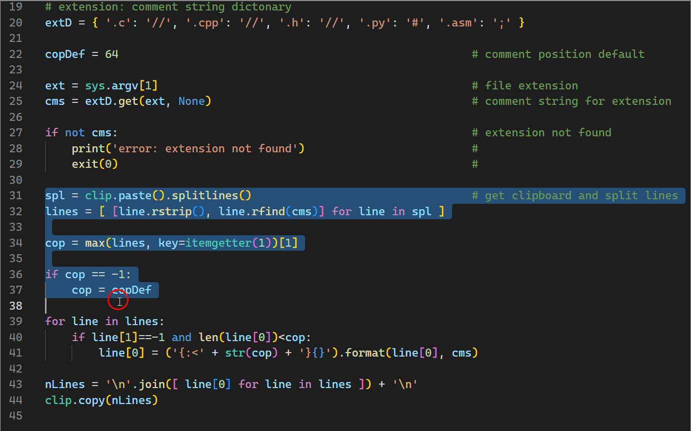

# **padSel**
### **Column Homogenous Comment Positions for vsCode**

<br>

**Because of the lack of a real column edit function in vsCode there is some typework to be saved with this script**

- select some lines, be careful to select complete lines
- the line with the most right comment is used as position template  
  if no existing comments are found a default position is used  
  already commented or longer lines are ignored
- press your binded key or run multiCommand.padSel (with command palette)
- the selection will be processed and replaced

<br>



<br>

### **settings.json**
``` 
{
    "multiCommand.commands": [
        {
            "command": "multiCommand.padSel",
            "interval": 250,                                    // higher for slow machines
            "sequence": [
                "editor.action.clipboardCopyAction",
                {
                    "command": "command-runner.run",
                    "args": {
                        "command": "padSel"
                    }
                },
                "workbench.action.focusActiveEditorGroup",
                "editor.action.clipboardPasteAction"
            ]
        }
    ],

    "command-runner.terminal.name": "runCommand",
    "command-runner.terminal.autoClear": true,
    "command-runner.terminal.autoFocus": false,                 // if true, interval in multiCommand may be higher
    "command-runner.commands": {
        "padSel": "..\\python.exe ..\\padSel.py ${fileExtname}" // adapt your paths to python.exe and padSel.py
    }
}
```

### **optional keybindings.json**
```
[
    {
        "key": "ctrl+alt+p",
        "command": "multiCommand.padSel",
        "when": "editorTextFocus"
    }
]
```

### **prequisites**
https://marketplace.visualstudio.com/items?itemName=ryuta46.multi-command  
https://marketplace.visualstudio.com/items?itemName=edonet.vscode-command-runner  
https://www.python.org/


<br>

#### V0.5 220709
---

#### contact
[qrt@qland.de](mailto:qrt@qland.de)
